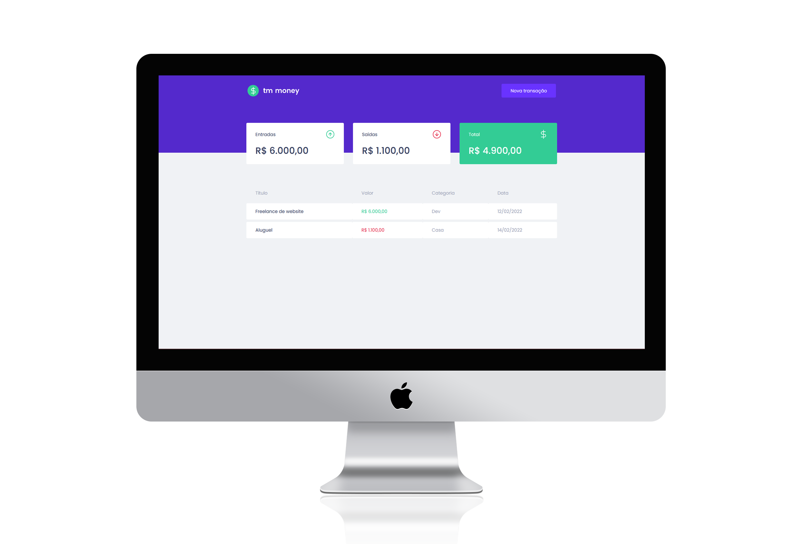

<p align="center">
  
</p>

### ♟ Summary

<p align="center">
  <a href="#-preview">Preview</a>&nbsp;&nbsp;|&nbsp;&nbsp;
  <a href="#-technologies-used">Technologies</a>&nbsp;&nbsp;|&nbsp;&nbsp;
  <a href="#-project">Project</a>&nbsp;&nbsp;|&nbsp;&nbsp;
  <a href="#-layout">Layout</a>&nbsp;&nbsp;|&nbsp;&nbsp;
  <a href="#-instructions">Instructions</a>&nbsp;&nbsp;|&nbsp;&nbsp;
  <a href="#-license">License</a>&nbsp;&nbsp;|&nbsp;&nbsp;
  <a href="#-development">Development</a>
</p>

### 📱 Preview

<p align="center">
  
</p>

### 📚 Technologies used

This project was developed with the following technologies:

- [React](https://reactjs.org/)
- [TypeScript](https://www.typescriptlang.org/)
- [Styled Components](https://styled-components.com/)
- [MirageJS](https://miragejs.com/)
- [Axios](https://axios-http.com/)
- [Polished](https://polished.js.org/)

### 🚀 Project

**tm money** is a simple and effective alternative to manage your finances, allowing you to register entries and exits from your finances

### 🎨 Layout

You can view the project layout [here](<https://www.figma.com/file/0xmu9mj2TJYoIOubBFWsk5/dtmoney-Ignite-(Copy)>). Remembering that you need to have a [Figma](http://figma.com/) account.

### 🎓 Instructions

**Clone** the repository

```bash
git clone https://github.com/vargastm/tm-money.git
```

To run **tm money** - Open the **tm money** folder with the terminal and **run** the commands:

```bash
yarn install
yarn start
```

> Server will be running on localhost:3000

### 📝 License

**tm money** is released under the [MIT License](./LICENSE) para mais detalhes.

---

### 👨‍💻 Development

Developed with 💜 by **Tiago Martins Vargas**
